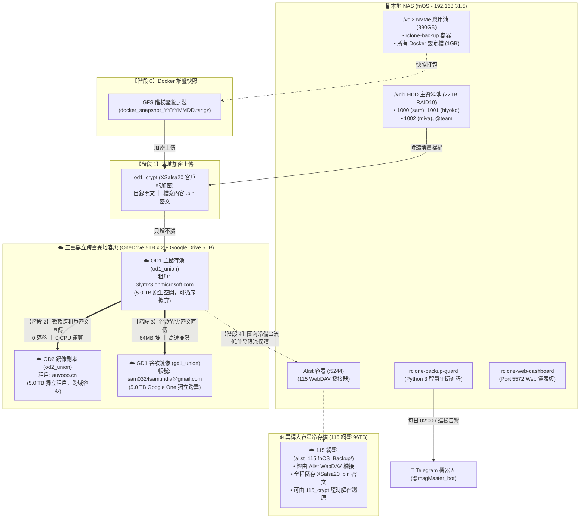

# 🛡️ fnOS 5-4-3 企業級跨雲端三雲鼎立加密備份系統規劃書
> **Architecture & Operation Blueprint for Enterprise-Grade 5-4-3 Triple-Cloud Backup Solution**  
> *維護者：sam0324sam ｜ 核心引擎：Docker + Rclone + Alist + Python SRE 守衛 ｜ 版本：v4.0 (5-4-3 Triple-Cloud Edition)*

---

## 📑 目錄
1. [系統背景與設計原則](#一-系統背景與設計原則)
2. [系統拓撲與架構設計](#二-系統拓撲與架構設計)
3. [多階段備份流程與資料流向](#三-多階段備份流程與資料流向)
4. [儲存擴充與負載策略 (方案 A 循序填滿)](#四-儲存擴充與負載策略-方案-a-循序填滿)
5. [Docker 堆疊 GFS 階梯式生命週期規劃](#五-docker-堆疊-gfs-階梯式生命週期規劃)
6. [零信任安全與資安防禦體系](#六-零信任安全與資安防禦體系)
7. [SRE 監控、熔斷與 Telegram 維運戰報](#七-sre-監控熔斷與-telegram-維運戰報)
8. [災難復原手冊 (Disaster Recovery SOP)](#八-災難復原手冊-disaster-recovery-sop)
9. [日常維護與 CLI 指令手冊](#九-日常維護與-cli-指令手冊)

---

## 一、 系統背景與設計原則

本專案旨在為 fnOS NAS 打造一套**高可靠、防勒索病毒、跨租戶容災、跨雲異質、異構冷備、零運維**的 5-4-3 雲端自動化備份體系。

### 🌟 核心目標 (5-4-3 跨雲端三雲鼎立備份鐵律)
* **5 份資料副本**：本地原始資料 + OD1 雲端主儲存 + OD2 雲端異地鏡像 + GD1 谷歌異雲鏡像 + 115 網盤 96TB 境內冷存檔。
* **4 種不同介質/體系**：本地實體 NVMe/HDD 陣列 + 微軟 M365 國際公有雲 + 谷歌 Google Cloud 國際公有雲 + 115 境內大容量冷儲存網盤。
* **3 處實體異地/供應商隔離**：
  1. **微軟跨租戶隔離 (Cross-Tenant)**（海外/香港節點：`3lym23` ➜ `auvooo`）
  2. **谷歌跨雲端隔離 (Cross-Cloud Provider)**（Google One / Google Cloud 全球高可用節點）
  3. **115 境內節點隔離**（境內獨立機房超大容量冷儲存），徹底規避單一雲端供應商斷供、風控封鎖或國際海纜斷裂風險。

### 💎 設計原則
1. **零信任客戶端加密 (Client-side Zero-Trust)**：檔案離開 NAS 前，於內存完成 XSalsa20 強度加密，雲端僅儲存 `.bin` 密文，微軟、谷歌與 115 均無法分析檔案內容，100% 免疫國內外網盤特徵審查與屏蔽。
2. **只增不減 (Append-Only Copy)**：本地誤刪或遭受勒索病毒加密修改時，雲端歷史檔案**永不自動刪除**。
3. **冷熱資料分離 (Storage Tiering)**：
   * 守衛程式與高頻日誌置於 **`/vol2` (NVMe 高速 SSD)**，避免日常巡檢喚醒硬碟。
   * 資料來源讀取 **`/vol1` (22TB RAID 10 大容量機械陣列)**，兼顧極速讀寫與延長硬碟壽命。
4. **流式跨雲直傳 (Zero-CPU Cloud-to-Cloud Streaming)**：
   * 核心鏈路（OD1 ➜ OD2、OD1 ➜ GD1）直接串流傳輸 XSalsa20 密文，0 NAS 硬碟讀寫，0 二次加解密，極速並發達成 RPO 目標。
5. **解耦與隔離冷歸檔 (Decoupled Cold Archival)**：
   * 異構冷鏈路（115 網盤）在核心公有雲完成後接續執行，採用低並發安全限流參數（`--transfers=1`），其限速或波動不阻塞主備份流程。
6. **零寫死自適應 (Zero-Hardcoding)**：自動探索本地 UID 使用者目錄、自動掃描多雲合流池、動態生成行動端最適排版戰報。

---

## 二、 系統拓撲與架構設計



---

## 三、 多階段備份流程與資料流向

系統於每日凌晨 **02:00** 自動啟動流水線（Pipeline）：

### 1. 階段 0：Docker 容器堆疊快照 (GFS Snapshot)
* **來源**：`/docker_src` (唯讀掛載實體 `/vol2/1000/docker/`)。
* **處理**：排除日誌、快取與 `.git`，使用 `tar -czf` 完整封裝 Linux 權限、UID/GID 與軟連結。
* **上傳**：推送至 `od1_crypt:docker_snapshots/`。
* **淘汰**：執行 GFS 生命週期演算法，淘汰過期快照。

### 2. 階段 1：NAS 主資料增量上傳 (User Data Incremental)
* **來源**：`/data` (唯讀掛載實體 `/vol1/`)。
* **探索**：自動掃描所有純數字 UID 目錄（`1000`、`1001`、`1002`...）及 `@team`，過濾相簿快取與回收站。
* **比對**：依檔案大小（Size）與修改時間（ModTime）進行高速增量比對，未變更檔案秒跳過。
* **加密**：經過 `od1_crypt:` 即時加密後寫入 `od1_union:`。

### 3. 階段 2：微軟雙租戶密文鏡像直傳 (OD1 ➜ OD2)
* **路徑**：`od1_union:` ➜ `od2_union:`。
* **原理**：採用**純內存流式傳輸（In-Memory Stream-Through）**，資料以 64MB 區塊在 NAS 記憶體內轉發，**完全不落硬碟，零磁頭磨損**。
* **免算力**：搬運已加密好的 `.bin` 密文，NAS 不進行二次加解密，CPU 使用率趨近於 0%。

### 4. 階段 3：谷歌異雲密文鏡像直傳 (OD1 ➜ GD1 5TB)
* **路徑**：`od1_union:` ➜ `gd1_union:`。
* **跨雲性能最佳化**：針對 Google Drive 傳輸特性，配置 64MB 區塊緩衝（`--drive-chunk-size=64M`）與高並發通道（`--transfers=4`、`--checkers=8`、`--tpslimit=10`），大幅縮短大型檔案同步延遲。
* **異質防護**：串流已加密之 `.bin` 密文直達 Google One 雲端，徹底防範跨雲平台供應商風險。

### 5. 階段 4：異構大容量冷歸檔 (115 Cloud Cold Archival)
* **路徑**：`od1_union:` ➜ `alist_115:fnOS_Backup/`。
* **橋接原理**：NAS 本機 Alist 容器提供 WebDAV (`:5244/dav/backup/115`)，Rclone 直接向其串流寫入。
* **限流安全策略**：115 網盤具有嚴格的防濫用與頻寬限制，階段 4 強制採用低並發保護（`--transfers=1`、`--checkers=2`、`--tpslimit=2`、`--timeout=2h`），確保穩定不斷流。
* **容錯隔離**：階段 4 與核心鏈路解耦，115 若發生限速、排隊或網路波動，守衛日誌將記錄警示，絕不中斷主備份流程。
* **端到端保密**：115 上的所有內容均為加密後的 `.bin` 密文，兼具 96TB 巨量歸檔與隱私合規，隨時可由 `115_crypt:` 解密還原。

---

## 四、 儲存擴充與負載策略 (方案 A 循序填滿)

當單一 5TB 帳號即將寫滿時，本系統支援**無縫橫向擴充（Scale-Out）**，上層加密與掛載完全無需變動。

### 寫入策略：方案 A（循序填滿 / 溢流模式，首選推薦）
* **核心配置**：
  * `create_policy = ff` (First Found 依序填滿)
  * `action_policy = epff` (優先於既有路徑帳號操作)
  * `min_free_space = 50G` (可用空間低於 50GB 時自動溢流至下一帳號)
* **優勢**：
  * **零碎片化**：帳號 1（5TB）沒滿前，所有檔案與目錄 100% 留在帳號 1。
  * **資料夾絕不拆分**：避免 100 張相片被拆成 50/50 散落兩帳號，登入微軟/谷歌網頁版直觀清爽。

### 擴充 SOP（當收到容量低於 100GB 告警時）：
1. 取得新帳號（如 `od1_2` 或 `gd1_2`）授權。
2. 編輯 `config/rclone.conf`，新增對應區塊。
3. 將對應 union 由 alias 切換為 union：
   ```ini
   [od1_union]
   type = union
   upstreams = od1_1:fnOS_Backup od1_2:fnOS_Backup
   action_policy = epff
   create_policy = ff
   min_free_space = 50G
   ```
4. 儲存即可，守衛程式將自動將新資料填入新帳號！

---

## 五、 Docker 堆疊 GFS 階梯式生命週期規劃

為防止某個容器設定改壞但太晚發現，系統實作企業級 **Grandfather-Father-Son (GFS)** 時光機：

| 層級 (Tier) | 保存週期 | 快照頻率 | 份數 | 目的 |
| :--- | :--- | :--- | :--- | :--- |
| **Son (日快照)** | 最近 **14 天** | 每天 1 份 | 14 份 | 應對近期的配置改壞、密碼庫失誤立即復原 |
| **Father (週快照)** | 最近 **10 週 (70 天)** | 每週日 1 份 | 8 份 | 應對中期未察覺的資料損毀或異常 |
| **Grandfather (月快照)**| 最近 **1 年 (365 天)** | 每月 1 號 1 份 | 12 份 | 年度存檔時光機，可隨時復原歷史特定月份狀態 |

* **總快照上限**：約 **34 份**。
* **空間耗費**：總計僅約 **14 ~ 16 GB**（不到 5TB 的 0.3%）。
* **三雲端同步修剪**：演算法同時向 `od1_crypt`、`od2_crypt` 與 `gd1_crypt` 執行過期淘汰，確保存放空間整齊一致。

---

## 六、 零信任安全與資安防禦體系

### 1. 檔案內容實體加密
* 採用 **XSalsa20 演算法** 進行串流加密。
* 雲端原生檢視僅能看見目錄架構與 `.bin` 密文檔案，無法預覽或分析任何檔案真實內容。

### 2. 憑證分離與安全範本
* 敏感金鑰與 Telegram Token 集中於本機 `.env`（Linux 權限 `600`）。
* Git 版本庫透過 `.gitignore` 嚴格隔離真實 `rclone.conf`、`.env` 與 `logs/`。
* 程式庫提供脫敏範本：`config/rclone.conf.example` 與 `.env.example`。

### 3. 微軟 OAuth 權限避坑規範
* 避開預設的 `.All` 全域權限（避免觸發 Entra ID「需要管理員核准」死鎖）。
* 強制使用限縮作用域：`access_scopes = Files.Read Files.ReadWrite offline_access`，確保一般子帳號直通授權。

---

## 七、 SRE 監控、熔斷與 Telegram 維運戰報

### 1. 告警與熔斷機制
* **每 6 小時靜默巡檢**：檢查微軟 Token 有效性與 API 連通性（正常狀態靜音，不疲勞洗版）。
* **容量告警門檻 (< 100 GB)**：
  * 單帳號剩餘 < 100GB 且有其他帳號時 ➜ 發送「ℹ️ 容量提示（建議擴容）」。
  * 所有帳號剩餘 < 100GB ➜ **主動熔斷暫停備份**，發送「⚠️ 空間耗盡警報」，防止寫爆拋錯。
* **帳號失效告警**：Token 失效時立即暫停備份並發送緊急告警。

### 2. 每日 02:00 全維度自適應日報格式
Telegram 戰報採用手機最適化垂直結構，動態讀取 Linux 核心容量與跨雲 API，排版範例：

```html
📊 【fnOS 5-4-3 跨雲端三雲鼎立每日維運日報】
📅 報告時間：2026-09-07 02:08:15

🖥️ 本地資料池 (/vol1)
• 陣列容量：21.8 TB ｜ 剩餘可用：21.1 TB
• 目前水位：714.2 GB (3.2%)
• 自動納管：1000, 1001, 1002, @team

☁️ OD1 主儲存池 (od1_union)
• 聚合總量：5.0 TB ｜ 剩餘可用：4.3 TB
• 目前水位：714.2 GB (14.0%)
• 節點清單：
  └ od1_1 🟢 剩餘 4.3 TB

☁️ OD2 鏡像副本 (od2_union)
• 聚合總量：5.0 TB ｜ 剩餘可用：4.3 TB
• 目前水位：714.2 GB (14.0%)
• 節點清單：
  └ od2_1 🟢 剩餘 4.3 TB

☁️ GD1 谷歌鏡像 (gd1_union)
• 聚合總量：5.0 TB ｜ 剩餘可用：5.0 TB
• 目前水位：0.0 B (0.0%)
• 節點清單：
  └ gd1_1 🟢 剩餘 5.0 TB

☁️ 115 異構冷歸檔池 (alist_115)
• 網盤容量：96.0 TB ｜ 狀態：🟢 在線連通 (Alist WebDAV)
• 密文路徑：alist_115:fnOS_Backup/ (XSalsa20 端到端保密)

⚡ 本次備份傳輸總結
• 階段一 (NAS ➜ OD1 加密)：✅ 成功
• 階段二 (OD1 ➜ OD2 鏡像)：✅ 成功
• 階段三 (OD1 ➜ GD1 鏡像)：✅ 成功 (已加密鏡像)
• 階段四 (OD1 ➜ 115 冷歸檔)：✅ 成功 (已加密鏡像)
• 容器快照 (Docker GFS)：✅ 已封存 (496 MB，GFS 階梯保留中)
• 執行總耗時：3 分 45 秒

🛡️ 5-4-3 容災鏈路狀態
• 鏈路檢核：🛡️ 完全合規 (5-4-3 Triple-Cloud Verified)
• 拓撲節點：[本地陣列] 🟢 ➜ [OD1 微軟主本] 🟢 ➜ [OD2 微軟鏡像] 🟢 ➜ [GD1 谷歌鏡像] 🟢 ➜ [115 國內冷備] 🟢

⏰ 下次例行備份：每日 02:00
```

---

## 八、 災難復原手冊 (Disaster Recovery SOP)

### 情境 1：使用者誤刪本地相片或檔案，需單獨還原
從 `od1_crypt:` 或 `od2_crypt:` 提取解密檔案至指定路徑：
```bash
# 還原特定目錄 (例如 hiyoko 的相片)
docker exec -it rclone-backup-guard rclone copy "od1_crypt:1001/Photos" "/data/1001/Photos_Restored" --config=/config/rclone/rclone.conf -P
```

### 情境 2：Docker 容器配置損壞或回滾歷史快照
從微軟或谷歌雲端拉取歷史 GFS 壓縮包並在本地還原：
```bash
# 1. 檢視雲端所有可用的 GFS 快照
docker exec -it rclone-backup-guard rclone lsf "od1_crypt:docker_snapshots/" --config=/config/rclone/rclone.conf

# 2. 下載特定日期的快照 (例如 20260906)
docker exec -it rclone-backup-guard rclone copy "od1_crypt:docker_snapshots/docker_snapshot_20260906.tar.gz" "/tmp/" --config=/config/rclone/rclone.conf -P

# 3. 解壓還原至本機 (在 NAS host 執行，保留原始 UID/權限)
tar -zxvf /tmp/docker_snapshot_20260906.tar.gz -C /vol2/1000/docker/
```

### 情境 3：微軟帳號遭遇風控或服務中斷時，從 Google Drive 解密還原
微軟服務不可用時，直接切換由 Google Drive 5TB 原生鏡像還原：
```bash
# 從 Google Drive 解密還原指定使用者資料夾
docker exec -it rclone-backup-guard rclone copy "gd1_crypt:1000/MyDocuments" "/data/1000/MyDocuments_Restored" --config=/config/rclone/rclone.conf -P
```

### 情境 4：國際海纜斷裂或公有雲不可抗力時，從 115 網盤解密還原
若國際連線中斷，可隨時透過境內高速直連之本機 `115_crypt:` 自動解密還原：
```bash
# 從 115 網盤解密還原指定使用者資料夾
docker exec -it rclone-backup-guard rclone copy "115_crypt:1000/MyDocuments" "/data/1000/MyDocuments_Restored" --config=/config/rclone/rclone.conf -P
```

### 情境 5：NAS 整機損毀或新機冷啟動復原 (Bare-metal Recovery)
1. 在新機器安裝 Docker 與 Git。
2. Clone 本倉庫：
   ```bash
   git clone git@github.com:sam0324sam/fnos-onedrive-backup.git /vol2/1000/docker/rclone-backup
   ```
3. 依 `config/rclone.conf.example` 與 `.env.example` 填回金鑰。
4. 全量下載解密資料庫與使用者目錄（可選任一健康雲端節點）：
   ```bash
   docker exec -it rclone-backup-guard rclone copy od1_crypt: /data/ --config=/config/rclone/rclone.conf -P
   ```

---

## 九、 日常維護與 CLI 指令手冊

進入專案目錄：
```bash
cd /vol2/1000/docker/rclone-backup
```

| 維護情境 | 執行指令 |
| :--- | :--- |
| **手動健康與容量檢查** | `docker exec rclone-backup-guard python3 /app/scripts/sync_manager.py --check-only` |
| **手動測試 Telegram 戰報** | `docker exec rclone-backup-guard python3 /app/scripts/sync_manager.py --test-report` |
| **手動立即執行 Docker GFS 備份**| `docker exec rclone-backup-guard python3 /app/scripts/sync_manager.py --docker-backup-now` |
| **手動立即執行 Google Drive 鏡像**| `docker exec rclone-backup-guard python3 /app/scripts/sync_manager.py --gdrive-sync-now` |
| **手動立即執行 115 冷歸檔** | `docker exec rclone-backup-guard python3 /app/scripts/sync_manager.py --cold-sync-now` |
| **手動立即觸發全量三雲鼎立備份** | `docker exec rclone-backup-guard python3 /app/scripts/sync_manager.py --sync-now` |
| **即時查看守衛即時日誌** | `docker logs -f rclone-backup-guard` |
| **檢視詳細歷史日誌** | `cat logs/manager.log` ｜ `cat logs/phase3_gdrive_mirror.log` ｜ `cat logs/phase4_cold_115.log` |
| **存取 Web GUI 儀表板** | 瀏覽器開啟 `http://<NAS_IP>:5572/` (內網免密碼直連) |

---
*本文件由 AI 研發中心架構團隊（Orchestra Edition）維護，遵循 SOTA 儲存架構與零信任安全規範。*
